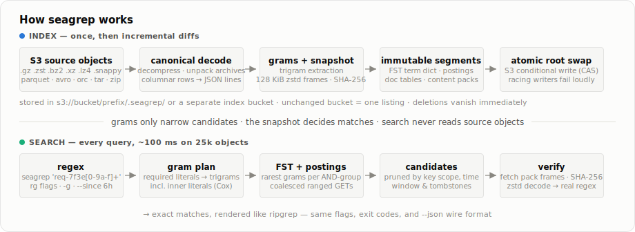
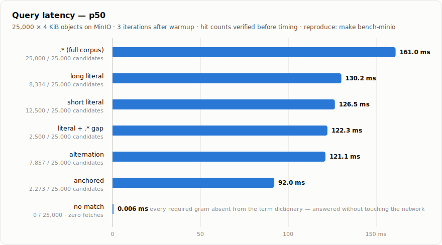

# holys3

[](https://github.com/TalkingComputers/holys3/actions/workflows/ci.yml)
[](https://crates.io/crates/holys3)
[](https://docs.rs/holys3)

holys3 searches S3 buckets with regular expressions. It works like grep, but
instead of scanning your objects on every query, it builds a trigram index and
a compressed snapshot of the decoded content once, stores both in S3, and
answers queries from those alone. A typical search over 25,000 objects returns
in about 100 ms. The CLI follows ripgrep: same flags, same exit codes, same
`--json` output.

Dual-licensed under MIT or Apache-2.0.

```sh
holys3 index s3://my-logs/prod                # build the index, once
holys3 'req-7f3e9a2c1b' s3://my-logs/prod     # then grep it
holys3 -i 'timeout' s3://my-logs -g '*.gz' -C2 --since 6h
```

[Installation](#installation) •
[Usage](#usage) •
[How it works](#how-it-works) •
[Performance](#performance) •
[Architecture](ARCHITECTURE.md) •
[Changelog](CHANGELOG.md)

### Why use holys3?

S3 has no grep. The usual workarounds scan: downloading everything and running
rg pays for every object on every query, and Athena bills per byte scanned.
holys3 pays the scan once, at index time. After that:

- Queries read small index ranges plus only the snapshot bytes of candidate
  documents. A pattern that can't match anything answers in microseconds,
  without a single network request.
- Results are exact. The index only narrows the candidate set; a real Rust
  regex over snapshot bytes decides every match, so there are no index
  approximations and no false positives.
- Compressed objects (gzip, zstd, bzip2, xz, lz4, snappy, brotli, zlib)
  decompress transparently, including the multi-member concatenations that
  ALB and CloudTrail actually deliver.
- Columnar files are greppable. Parquet, Avro, ORC and Arrow rows are
  projected to canonical JSON lines, and ZIP/TAR members are searched as
  individual documents.
- Indexing is incremental. Re-runs fetch only new or changed objects,
  deletions disappear from results immediately, and an unchanged bucket costs
  one listing.
- `--since 6h` scopes a search by the timestamps embedded in object keys. It
  understands `2026/06/09` paths, hive partitions, `dt=`/`date=` prefixes,
  and ALB/CloudTrail/CloudFront filename stamps.
- It speaks to anything S3-compatible: AWS, MinIO, Cloudflare R2.
- Search keeps working after the source objects are deleted, because it only
  reads the snapshot.

### Why not use holys3?

- The index contains a compressed copy of your decoded content, not just
  trigrams. Protect it with the same access controls, retention policy, and
  encryption requirements as the source data. Use private buckets.
- The first index build reads every object once. That is the price of never
  scanning again.
- No multiline mode: patterns are line-oriented exactly like rg without `-U`.
- Continuous indexing (`--watch`) polls after each cycle. It doesn't consume
  bucket notifications, daemonize, or install a system service.
- The design assumes occasional index writers, not a write-heavy pipeline.
  Concurrent `holys3 index` runs are safe, but a losing writer errors instead
  of retrying forever.
- S3 Express directory buckets aren't supported yet.
- The CLI is the supported surface. The library crates are not a stable API.

### Installation

Prebuilt binaries for Linux (x86_64, arm64), macOS (Intel, Apple Silicon), and
Windows ship with every
[GitHub release](https://github.com/TalkingComputers/holys3/releases):

```sh
cargo binstall holys3   # fetches the prebuilt binary for your platform
cargo install holys3    # or build from source (Rust 1.94.1+)
```

Release archives include SHA-256 checksums and GitHub build-provenance
attestations. Verify one with
`gh attestation verify <archive> -R TalkingComputers/holys3`.

### Usage

The shape is `holys3 PATTERN TARGET`, where TARGET is `s3://bucket[/prefix]`.
Credentials come from the standard AWS SDK provider chain, so environment
variables, shared profiles, IAM Identity Center (SSO) sessions,
`credential_process`, and container or instance roles all work as usual, and
temporary credentials refresh automatically.

First build the index. It lives in the bucket, under `<prefix>/.holys3/` by
default:

```sh
AWS_PROFILE=my-sso holys3 index s3://my-log-bucket/prod --region us-east-2
```

Then search:

```sh
holys3 'level":"ERROR' s3://my-log-bucket/prod --region us-east-2
```

Most rg flags do what you expect. `-i`/`-S` for case, `-C` for context, `-w`
for word boundaries, `-F` for fixed strings, `-l`, `-c`, `-m`, `-q`, and
`--json` emits rg-compatible JSON Lines:

```sh
holys3 -i 'timeout' s3://my-logs -C2 -g '*.gz' -g '!debug/*'
holys3 -w -F 'foo(' s3://my-code-bucket -l
holys3 'req-[0-9a-f]+' s3://my-log-bucket --json | jq .
```

Exit codes are rg's: `0` match, `1` no match, `2` error. Patterns are
line-oriented like rg: `^` and `$` anchor at every line, and a literal `\n` in
a pattern is an error. To search for a pattern that collides with a subcommand
name, use `-e`: `holys3 -e index s3://bucket`.

Searches can be scoped by key or by time:

```sh
holys3 'ERROR' s3://my-logs --since 6h
holys3 'ERROR' s3://my-logs --since 2026-06-09 --until 2026-06-10 --key-prefix prod/
```

`--key-prefix` prunes whole index segments before any fetch, and `--key-regex`
filters keys by pattern. `--since`/`--until` take absolute dates or relative
`30s`/`15m`/`6h`/`2d`/`1w` values. Keys without a recognizable timestamp are
searched anyway, with a note on stderr, so time scoping never silently hides
data.

To keep the index fresh, watch mode repeats the listing/diff/swap cycle on an
interval, finishes the active cycle cleanly on SIGINT/SIGTERM, and with
`--json` emits tagged `indexed`, `error`, and `stopped` lines on stdout:

```sh
holys3 index s3://my-log-bucket/prod --watch --interval 30
```

If the source bucket is read-only (or you just want the index elsewhere), put
it in its own bucket. Pass the same `--index` location when searching;
`--index-region` and `--index-endpoint` configure that connection separately:

```sh
holys3 index s3://my-log-bucket/prod --index s3://my-search-index/prod
holys3 'ERROR' s3://my-log-bucket/prod --index s3://my-search-index/prod
```

For MinIO, R2, or any other S3-compatible store, point `--endpoint` at it.
`--concurrency` (default 750) caps parallel requests.

Flag summary:

```text
-e PATTERN        multiple patterns, OR              -n / -N      line numbers on/off
-F                fixed strings                      --column     1-based match column
-i / -S / -s      ignore / smart / sensitive case    --heading    group under key (tty default)
-w                word boundaries (rg half-bounds)   --no-heading key:line:text (pipe default)
-l                files with matches                 -g GLOB      include/!exclude key globs
-c                count matching lines               -q           quiet, exit at first match
--count-matches   count individual matches           --color WHEN auto/always/never/ansi
-m NUM            max matching lines per object      --json       rg-compatible JSON Lines
-A/-B/-C NUM      context lines with -/-- separators --stats      candidate stats to stderr
```

### Object formats

Format detection is magic-first: extensions are not trusted, with one
exception. Brotli and zlib have no reliable container magic, so only `.br`,
`.zlib`, and `.zz` select those decoders, and the entire stream must validate.

| format                                | how it's searched                                                                                                                                  |
| ------------------------------------- | -------------------------------------------------------------------------------------------------------------------------------------------------- |
| gzip, zstd, bzip2, xz, snappy, lz4    | decompressed transparently, including multi-member/multi-stream concatenations and skippable frames                                                |
| brotli, zlib                          | decompressed via validated `.br`/`.zlib`/`.zz` extension hint                                                                                      |
| ZIP, TAR                              | every regular member is its own document at `object.zip!/member/path`; nested archives recurse to four layers; encrypted members reject the source |
| Parquet, Avro, Arrow IPC/Feather, ORC | each row becomes one canonical JSON line; line numbers refer to rows                                                                               |
| everything else                       | searched as plain text (JSONL, CSV, syslog, …)                                                                                                     |

Projection and decompression happen at one canonical decoder boundary, so the
index and the verifier see identical bytes. Truncated or corrupt-tailed
streams salvage: the cleanly decoded prefix is searched and a warning names
the object. Undecodable objects are excluded loudly, never silently searched
incorrectly.

A few deliberate rejections: raw (unframed) snappy has no magic bytes and is
undetectable by design, so it's unsupported as an object format (it still
decodes fine inside Avro files, where the container names the codec). lz4
legacy frames (`lz4 -l` output) are detected and rejected loudly rather than
decoded. Expansion is capped at 64 GiB per physical source, 100,000 archive
members, and four nested format layers; oversized decoded output spills to
private temporary files instead of memory.

### How it works

<picture>
  <source media="(prefers-color-scheme: dark)" srcset=".github/assets/how-it-works-dark.svg">
  
</picture>

1. The query planner extracts gram constraints from the regex: prefix, suffix,
   and required inner literals (Cox-style), so `.*ERROR.*` prunes instead of
   scanning.
2. The term dictionary (an FST) maps each gram to its postings offset and doc
   count, so selectivity is known before any fetch. Absent grams answer
   instantly, and only the rarest grams per AND-group are fetched at all.
3. Posting blocks are read with coalesced ranged GETs, and candidates are
   pruned by key scope before any content is fetched.
4. Candidate bytes come from immutable content-addressed packs: independent
   128 KiB zstd frames, each SHA-256 verified before decompression. Adjacent
   frames merge into bounded range GETs, and the final regex runs on a worker
   pool, printing unordered across objects like rg's parallel mode.

The index itself is a set of immutable, content-addressed segments. Each root
is a complete snapshot of one generation; the root pointer swap is a
compare-and-swap via S3 conditional writes, so a racing concurrent index run
fails loudly instead of corrupting anything. Small segments merge
automatically, a segment is physically repacked once dead documents or bytes
reach 25% (or on `--purge-deleted`), and replaced segments are
garbage-collected. Every blob carries a length and SHA-256 contract, and
readers reject truncation or corruption before using it.

The root also records the indexed endpoint, bucket, and prefix. A search may
select a narrower subtree of that source, but a broader or different source
fails rather than returning an incomplete result. `--rebuild` re-indexes from
scratch and is required to repurpose an index location. Two gram strategies
exist (`--strategy trigram`, the default, and `--strategy sparse`); switching
rebuilds automatically.

[ARCHITECTURE.md](ARCHITECTURE.md) covers the crate boundaries, segment
format, and memory bounds in detail.

### Performance

Numbers from the tracked benchmark: 25,000 synthetic 4 KiB objects on MinIO,
release build, three measured iterations after one warmup. Every corpus,
planted hit count, candidate count, and byte count is deterministic and
checked before timing. Reproduce with
`make bench-minio BENCH_OBJECTS=25000 BENCH_ITERATIONS=3`.

<picture>
  <source media="(prefers-color-scheme: dark)" srcset=".github/assets/bench-latency-dark.svg">
  
</picture>

<!-- BENCH:START -->

| scenario      |  hits | candidates/total | prune ratio |     bytes |  p50 ms |  p95 ms |  p99 ms | concurrency=1 p50 ms |
| ------------- | ----: | ---------------: | ----------: | --------: | ------: | ------: | ------: | -------------------: |
| short_literal | 12500 |      12500/25000 |       0.500 |  51200000 | 126.481 | 135.274 | 135.274 |              144.098 |
| long_literal  |  8334 |       8334/25000 |       0.333 |  34136064 | 130.168 | 133.678 | 133.678 |              139.821 |
| alternation   |  7857 |       7857/25000 |       0.314 |  32182272 | 121.114 | 133.386 | 133.386 |              127.223 |
| anchored      |  2273 |       2273/25000 |       0.091 |   9310208 |  92.022 | 100.881 | 100.881 |               88.671 |
| no_match      |     0 |          0/25000 |       0.000 |         0 |   0.006 |   0.006 |   0.006 |                0.005 |
| QAll          | 25000 |      25000/25000 |       1.000 | 102400000 | 161.019 | 163.742 | 163.742 |              168.181 |
| dot_star_gap  |  2500 |       2500/25000 |       0.100 |  10240000 | 122.263 | 124.068 | 124.068 |              105.753 |

<!-- BENCH:END -->

CI reruns the end-to-end benchmark and a microbenchmark suite
(`make bench-micro`) for every pull request, gates statistically confident
regressions, verifies exact hit counts, and enforces peak-RSS ceilings across
large-object, archive, and churn workloads. The committed
[`benches/baseline.json`](benches/baseline.json) is the reporting reference;
refresh it only from CI's `bench-micro` artifact.

As always with benchmarks: this is one corpus with one object-size
distribution on local MinIO. Your latencies against real S3 will include
network round-trips; the shape (pruning ratio drives cost) is the durable
part, not the exact milliseconds.

### Security

Use private buckets. The default index lives under `<source-prefix>/.holys3/`,
and `--index` can place it in a separately permissioned bucket. The index
contains compressed canonical decoded content, not only grams, so protect it
with the same access controls, retention policy, and encryption requirements
as the source data. holys3 contacts the configured source and index S3
endpoints plus the AWS credential endpoints required by the active SDK
provider chain, and nothing else.

Report vulnerabilities privately; see [SECURITY.md](SECURITY.md).

### Contributing

Read [ARCHITECTURE.md](ARCHITECTURE.md) before changing index, query, or S3
behavior, and [CONTRIBUTING.md](CONTRIBUTING.md) for setup and the CI checks.
The differential test suites are the correctness contract: indexed search must
exactly equal a decoded full scan, for every format, both gram strategies, and
every index lifecycle state.

### License

Licensed under either of:

- MIT license ([LICENSE-MIT](LICENSE-MIT))
- Apache License, Version 2.0 ([LICENSE-APACHE](LICENSE-APACHE))
